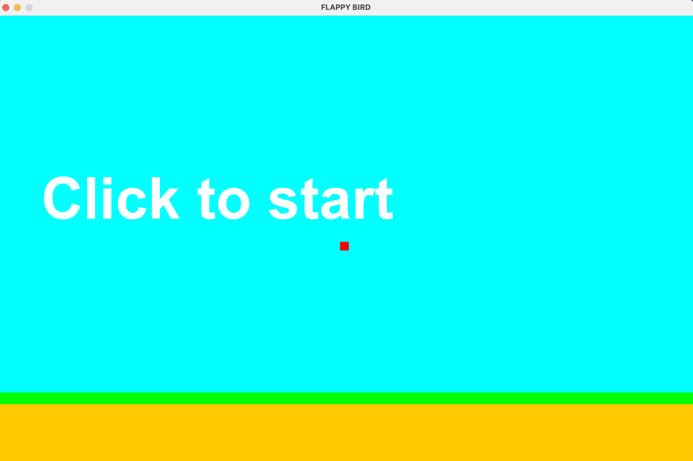
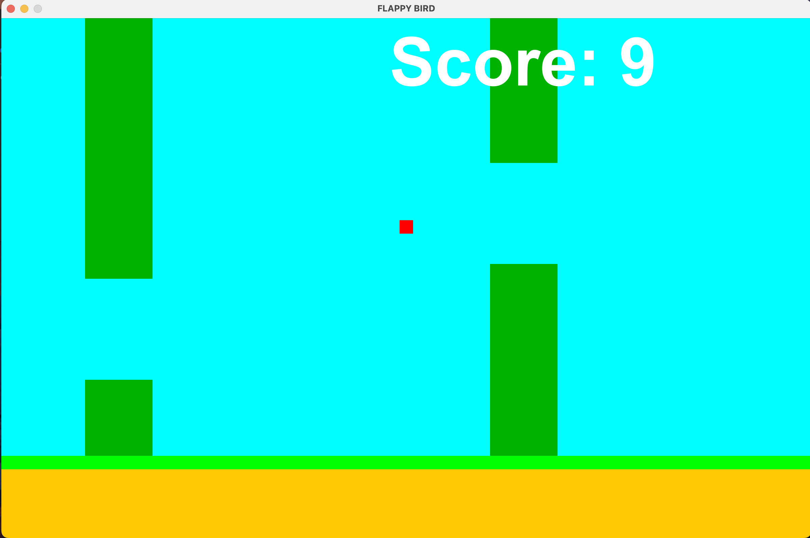

# Flappy Bird Game

## Overview

This project is a simple implementation of the classic Flappy Bird game in Java. The player controls the bird's vertical movement by making it "jump" to avoid colliding with the columns or the ground.

### Key Features

- **Game Mechanics:** Control the bird's movement using the spacebar or mouse clicks to navigate through columns.
- **Scoring System:** Earn points by successfully passing through columns.
- **Responsive Graphics:** The game features animated graphics and dynamic obstacle generation.

## Project Usage

The Flappy Bird game requires the player to navigate a bird through obstacles by making it jump at the right time. The game ends when the bird collides with a column or the ground. The player earns points by passing through the gaps between columns.

## Example

    

## Getting Started

### Prerequisites

- Java Development Kit (JDK)
- Java IDE such as Eclipse etc.

### Installation

1. **Clone the Repository**

```bash
   git clone https://github.com/arnavaggarwal75/Flappy-Bird-Game.git
```
2. **Open the Project**

    Import the project into your preffered IDE as a Java project.

2. **Running the Game**

   - Run the FlappyBird class to start the game.
   - Use the spacebar or mouse clicks to control the bird's movement.


### Project Structure
FlappyBird.java: Contains the main game logic and user input handling.

Renderer.java: Handles the rendering of the game graphics.