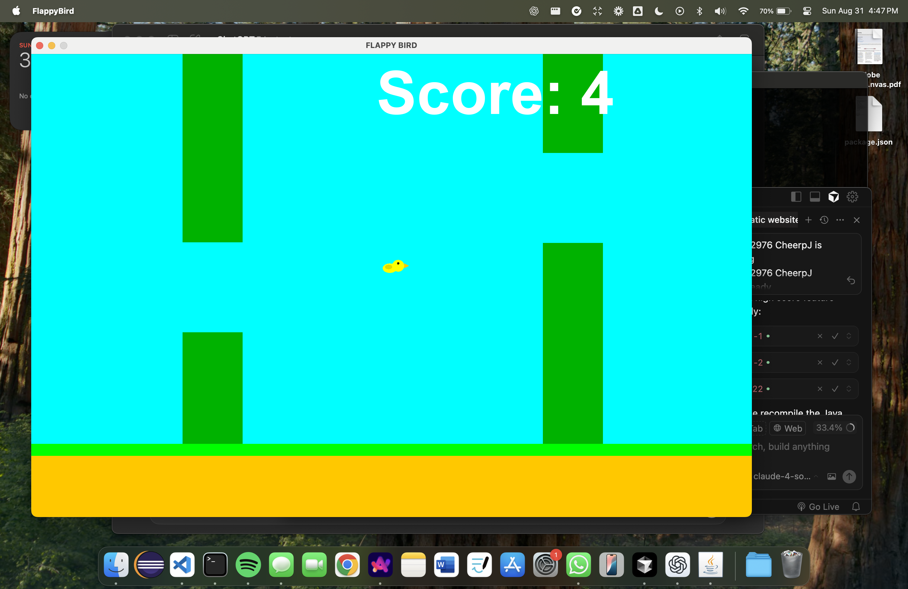
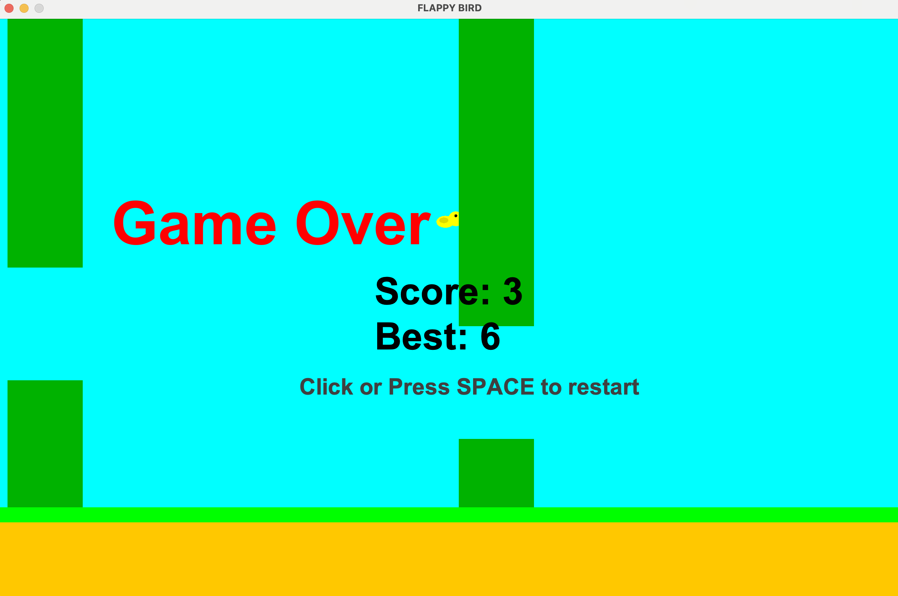

# Flappy Bird Game

## Overview
A simple Java implementation of the classic Flappy Bird game.  
Control the bird using the **spacebar** or **mouse clicks** to avoid obstacles and earn points.

### Key Features
- **Game Mechanics:** Jump to avoid columns and the ground.
- **Scoring System:** Points for each column gap passed.
- **Persistent High Score:** Saved between runs in `flappy_bird_highscore.txt`.

## Example



## Getting Started

### Prerequisites
- [Java Development Kit (JDK)](https://adoptium.net/) (17 or higher recommended)

### Installation
1. Clone the repository:

   ```bash
   git clone https://github.com/arnavaggarwal75/Flappy-Bird-Game.git
   cd Flappy-Bird-Game
   ```

2.	Compile the game:

   ```bash
   javac -d bin src/FlappyBird/*.java
   ```

3.	Package into a runnable JAR:

   ```bash
   jar cfe flappybird.jar FlappyBird.FlappyBird -C bin .
   ```

4.	Run the game:

   ```bash
   java -jar flappybird.jar
   ```

Controls
- Spacebar → Jump
- Mouse click → Jump

Project Structure
- src/FlappyBird/FlappyBird.java → Main game logic & input handling
- src/FlappyBird/Renderer.java → Graphics rendering
- flappy_bird_highscore.txt → Stores persistent high score
- public/ → Example images for README